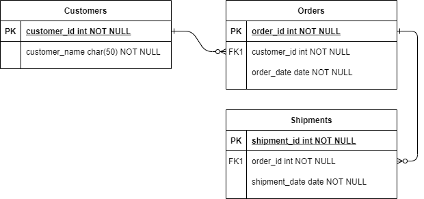

# Virto Commerce Task Module  

The Virto Commerce Task (or Task Management) module is designed for both managers and workers, providing a productivity-enhancing feature. Headquarters teams and business processes can use it to create task lists for stores and track their status by store or worker.

## Database Model

## Documentation

* [Task Management module user documentation](https://docs.virtocommerce.org/platform/user-guide/inventory/overview/)
* [REST API](https://virtostart-demo-admin.govirto.com/docs/index.html?urls.primaryName=VirtoCommerce.TaskManagement)
* [View on GitHub](https://github.com/VirtoCommerce/vc-module-task-management)

## References

* [Deployment](https://docs.virtocommerce.org/platform/developer-guide/Tutorials-and-How-tos/Tutorials/deploy-module-from-source-code/)
* [Installation](https://docs.virtocommerce.org/platform/user-guide/modules-installation/)
* [Home](https://virtocommerce.com)
* [Community](https://www.virtocommerce.org)
* [Download latest release](https://github.com/VirtoCommerce/vc-module-task-management/releases/latest)

## License

Copyright (c) Virto Solutions LTD.  All rights reserved.

Licensed under the Virto Commerce Open Software License (the "License"); you
may not use this file except in compliance with the License. You may
obtain a copy of the License at

<http://virtocommerce.com/opensourcelicense>

Unless required by applicable law or agreed to in writing, software
distributed under the License is distributed on an "AS IS" BASIS,
WITHOUT WARRANTIES OR CONDITIONS OF ANY KIND, either express or
implied.
